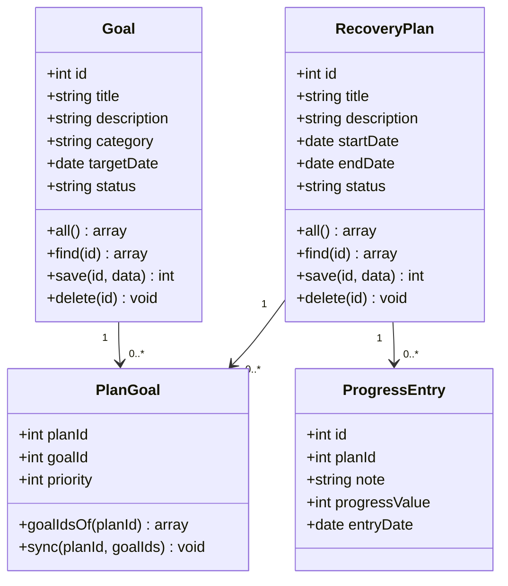

# Class diagram – M3 Recovery Journey

```mermaid
classDiagram
    class RecoveryPlan {
        +int id
        +string title
        +string description
        +date startDate
        +date endDate
        +string status
        +all() array
        +find(id) array
        +save(id, data) int
        +delete(id) void
    }
    class Goal {
        +int id
        +string title
        +string description
        +string category
        +date targetDate
        +string status
        +all() array
        +find(id) array
        +save(id, data) int
        +delete(id) void
    }
    class PlanGoal {
        +int planId
        +int goalId
        +int priority
        +goalIdsOf(planId) array
        +sync(planId, goalIds) void
    }
    class ProgressEntry {
        +int id
        +int planId
        +string note
        +int progressValue
        +date entryDate
    }
    RecoveryPlan "1" --> "0..*" PlanGoal
    Goal "1" --> "0..*" PlanGoal
    RecoveryPlan "1" --> "0..*" ProgressEntry
```
